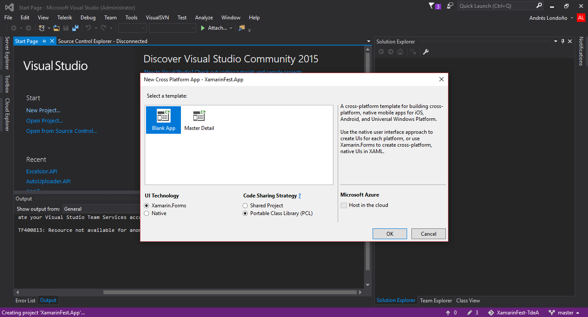
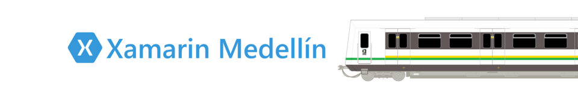

# Tabla de contenido

- [Objetivo del Laboratorio](#Objetivo-del-Laboratorio)


# Objetivo del Laboratorio

Construir una aplicación para Android, iOS y Windows 10, con Xamarin Forms con un mismo código compartido, que permita consumir una Azure function creada, la cual envia un correo electronico utilizando un servicio de azure conocido como SendGrid, agregando un destinatario, asunto y contenido del mensaje en la misma aplicación .


# Indicaciones antes de comenzar

### IDE

- Instala **Xamarin en Visual Studio**. Favor ver el siguiente enlace [Guía de instalación ambiente de desarrollo de Xamarin](https://aka.ms/installXamarin).
    - Si ya tienes Visual Studio instalado pero sin **Xamarin**, puedes agregar el complemento con esta [Guía de actualización para ambiente de desarrollo Xamarin](https://aka.ms/updateVSXamarin).

### Emuladores

# Introducción

Este proyecto es el ejercicio pensado para considerar que tienes ya todo instalado para un ambiente de desarrollo con Xamarin.

A continuación, se describen los pasos correspondientes para realizar un app disponible para Android, iOS y Windows con Xamarin Forms, consumiendo uno de los servicios de Microsoft Azure ya creados para el envio de correo. Recuerda que tambien puedes descargar el codigo de la solución ya realizado que se encuentra en la carpeta [code](https://github.com/aminespinoza/EnviaCorreosXamarinApp/tree/master/EjercicioBase).

Como lo dice la primera parte, si logras ejecutar los siguientes pasos sin problemas en tu equipo significará entonces que ya tienes todo listo para participar en varias iniciativas y además comenzar a desarrollar aplicaciones multiplataforma.

# Pasos

**Nota** Este ejercicio esta realizado en **visual studio 2015 community** y en idioma ingles, puede ser realizado de igual forma en visual studio 2017, xamarin studio o visual studio para MAC.


**XamarinFest.App**

1. Abrimos nuestro visual studio y procedemos a dar click en **Nuevo proyecto**.
1. Abierta nuestra ventana de creación de nuevo proyecto buscamos la plantilla de C# --> Cross-Platform.
1. Seleccionamos **Cross Platform App**.
1. Indicamos el nombre de nuestro proyecto **XamarinFest.App**.
1. Damos click en **Ok**.

    

1. Al crear nuestro proyecto web se abrirá la ventana correspondiente para seleccionar nuestra plantilla.
1. Seleccionamos la plantilla **Blank App**, **Xamarin Forms** y cambiamos la estrategia de codigo compartido a **Portable Class Library (PCL)**.
1. Damos click en **Ok** y esperemos que se creen los proyectos correspondientes a la solución.

    

1. Si observas bien, se han creado 4 proyectos correspondientes a la solución generados automaticamente con su respectivo nombramiento, a continuación se detalle para que es cada proyecto.    

    - **XamarinFest.App** : Proyecto de librerias de clases portables, cuyo objetivo es contener la mayor cantidad de codigo que pueda ser compartido entre plataformas, como son las vistas (.xaml) y clases (.cs) con logica de negocio de nuestra aplicación.
	
    - **XamarinFest.App.Android** : Proyecto correspondiente a la aplicación Android, contiene los recursos necesarios para empaquetar nuestra aplicación Android, imagenes, permisos de accesos, información, etc. **Requiere SDK Android, generalmente incluido en SDK Xamarin**

    - **XamarinFest.App.iOS** : Proyecto correspondiente a la aplicación iOS, contiene los recursos necesarios para empaquetar nuestra aplicación iOS, imagenes, permisos de accesos,  información, etc. **Incluido con SDK Xamarin, pero requiere conexion a una MAC para compilar (puede ser virtualizada)**

    - **XamarinFest.App.UWP** : Proyecto correspondiente a la aplicación Universal Windows Platforms (Windows 10), contiene los recursos necesarios para empaquetar nuestra aplicación Windows 10 (Windows mobile, Windows 10 desktop, Windows Hub, Windows Xbox...), imagenes, permisos de accesos, información, etc. **Requiere SDK Universal Windows Platforms (windos 10)**    

    

1. Vamos a darle un poco de diseño a nuestra aplicación, abrimos el archivo **MainPage.xaml** ubicado en el proyecto **XamarinFest.App** ya que esta asignado como pagina principal en **App.xaml.cs**

    - **Nota** : Si no visualizas la vista de diseño, probablemente requieras configurar el **Xamarin Previewer** , aunque para el ejercicio no es necesario que lo tengas configurado, solo requerimos la vista de codificación.

    

1. Escribe el siguiente código para crear una interfaz amigable que permita ingresar **destinatario, asunto, descripción y un botón para enviar**.
    - Cuando escribimos codigo Xaml para nuestras vistas, estamos reutilizando la misma interfaz para todas las plataformas.

```xml
<?xml version="1.0" encoding="utf-8" ?>
<ContentPage xmlns="http://xamarin.com/schemas/2014/forms"
             xmlns:x="http://schemas.microsoft.com/winfx/2009/xaml"
             xmlns:local="clr-namespace:XamarinFest.App"
             x:Class="XamarinFest.App.MainPage">
    <ContentPage.Resources>
        <ResourceDictionary>
            <Color x:Key="PrimaryColor">#468847</Color>
            <Color x:Key="BackgroundEntryColor">#E1E1E1</Color>
        </ResourceDictionary>
    </ContentPage.Resources>
    <ScrollView>
        <Grid BackgroundColor="#F2F2F2" Padding="10">
            <Grid.RowDefinitions>
                <RowDefinition Height="*"/>
                <RowDefinition Height="Auto"/>
            </Grid.RowDefinitions>
            <Grid Grid.Row="0">
                <StackLayout>
                    <Label Text="Xamarin Fest" HorizontalOptions="CenterAndExpand" FontSize="Large" TextColor="Gray"/>
                    <Label Text="Destinatario" FontSize="Medium" TextColor="{StaticResource PrimaryColor}"/>
                    <Entry x:Name="destinatario" BackgroundColor="{StaticResource BackgroundEntryColor}" TextColor="Black" />
                    <Label Text="Asunto" FontSize="Medium" TextColor="{StaticResource PrimaryColor}"/>
                    <Entry x:Name="asunto" BackgroundColor="{StaticResource BackgroundEntryColor}" TextColor="Black"/>
                    <Label Text="Mensaje" FontSize="Medium" TextColor="{StaticResource PrimaryColor}"/>
                    <Editor x:Name="mensaje" HeightRequest="200"  BackgroundColor="{StaticResource BackgroundEntryColor}" TextColor="Black"/>
                </StackLayout>
            </Grid>
            <Grid Grid.Row="1">
                <Button x:Name="BtnEnviarCorreo" Text="Enviar Correo" FontSize="Medium" BackgroundColor="{StaticResource PrimaryColor}" TextColor="#FFFFFF"/>
            </Grid>
        </Grid>
    </ScrollView>
</ContentPage>
```

   

1. Puedes probar el resultado ejecutando la aplicación en un emulador o dispositivo movil configurado, solo basta con hacer click derecho sobre el proyecto de la plataforma movil a probar y establecer como **proyecto de inicio**
    - **Android**

   

   - **Universal Windows Platforms (Windows 10)**

   

1. Ahora vamos a crear el evento click para el boton de enviar correo el cual debe consumir el servicio construido en azure, abre el archivo **MainPage.xaml.cs**

   

```csharp
        public MainPage()
        {
            InitializeComponent();
            BtnEnviarCorreo.Clicked += BtnEnviarCorreo_Clicked;
        }
        private void BtnEnviarCorreo_Clicked(object sender, EventArgs e)
        {

        }
```

1. Ahora es necesario consumir la Azure Function que envia los correos, pero primero es necesario instalar en nuestro proyecto portable **XamarinFest.App** el paquete requerido para peticiones Http.
Damos click derecho en **References** y seleccionamos --> **Manage Nuget Packages**

1. Buscamos con la palabra **Http** y seleccionamos el paquete llamado **Microsoft.Net.Http** y damos click en **instalar**.

   

1. Realizamos el mismo proceso con la libreria **Newtonsoft.Json** buscando con la palabra **json**.

   

1. Luego vamos a crear una clase llamada **Correo.cs**, para ello da click derecho sobre el proyecto **XamarinFest.App** Add --> class...

   

1. Crea las variables requeridas para el objeto correo.   

   

```csharp
namespace XamarinFest.App
{
    public class Correo
    {
        public string Destinatario { get; set; }
        public string Asunto { get; set; }
        public string Mensaje { get; set; }
    }
}
```
1. Volvamos al archivo **MainPage.xaml.cs** y ahora agreguemos un metodo respectivamente para el envio de datos al servicio, creando el objeto **Correo**.

1. Primero agregamos las referencias respectivas de las librerias que hemos instalado en el encabezado del archivo.

```csharp
using Newtonsoft.Json;
using System.Net.Http;
```

1. Vamos a crear el metodo correspondiente a el consumo del servicio que envia el correo electronico, allí se encuentra toda la configuración correspondiente al punto de acceso del servicio api.

    - Además, vamos a agregar una alerta cuando se envie el correo o cuando ocurra una excepción.

   

```csharp
using Newtonsoft.Json;
using System.Net.Http;
using System;
using System.Text;
using Xamarin.Forms;
namespace XamarinFest.App
{
    public partial class MainPage : ContentPage
    {
        public MainPage()
        {
            InitializeComponent();
            BtnEnviarCorreo.Clicked += BtnEnviarCorreo_Clicked;
        }

        private void BtnEnviarCorreo_Clicked(object sender, EventArgs e)
        {
            EnviarCorreo(new Correo() { Destinatario = destinatario.Text, Asunto = asunto.Text, Mensaje = mensaje.Text });
        }

        async private void EnviarCorreo(Correo correo)
        {
            try
            {
                using (var client = new HttpClient())
                {
                    string bodyRequest = JsonConvert.SerializeObject(correo);
                    await client.PostAsync("https://xamarinmed.azurewebsites.net/api/HttpTriggerCSharp1?code=VJ575b2M2otR6ynbCHz9J2tthGU7FfwxNguaUxOiP1wuorBGjoWJqA=="
                        , new StringContent(bodyRequest, Encoding.UTF8, "application/json"));
                    await DisplayAlert("Completado", "Correo enviado correctamente.", "Aceptar");
                }
            }
            catch (Exception ex)
            {
                await DisplayAlert("Error", "Ha ocurrido un error intentando consumir el servicio de Azure para enviar el correo.", "Aceptar");
            }
        }

    }
}
```

1. Si procedemos a ejecutar el aplicativo en cualquier plataforma, podemos evidenciar que inmediatamente se muestra el error intentando consumir el servicio.


 
# Vinculos recomendados

Forks of this project demonstrate how to extend and integrate with other libraries:

 - https://github.com/mgechev/switching-to-angular2 - code samples for the book ["Switching to Angular 2"](https://www.packtpub.com/web-development/switching-angular-2).


## Wiki Contributors

Here are all the awesome guys who are helping to make the project's wiki even better!
 
Andrés Londoño - Tecnical Lead and MVP Microsoft [Aandreslon]  
You can follow the [@Andreslon](https://github.com/angular/angular/blob/master/CHANGELOG.md).
 
# Sponsors



[Únete a la comunidad-Meetup](https://www.meetup.com/es-ES/Xamarin-Medellin/)


